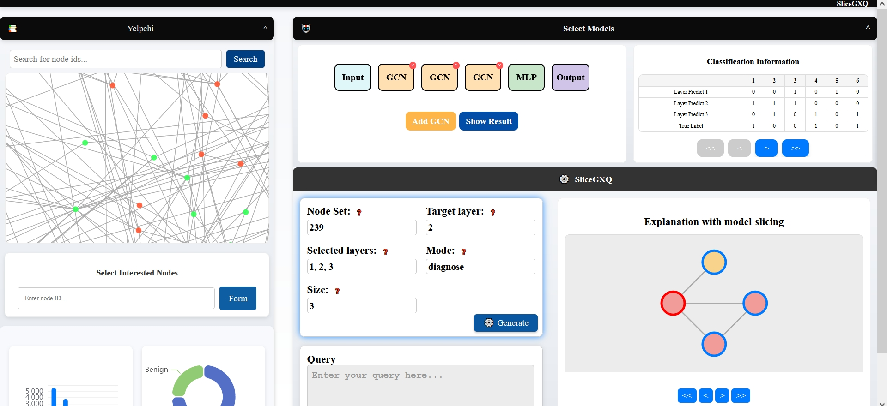

# Declarative Explanations for Graph Neural Networks: A Demonstration

This repository contains our paper, demo video link and the source code of the front-end and back-end used in our demo paper: 
**Declarative Explanations for Graph Neural Networks: A Demonstration**, SIGMOD(demo) 2025, by Haitong Tang, Tingting Zhu, Yinghui Wu, Arijit Khan, Tingyang Chen, Xiangyu Ke, Yunjun Gao

---

Graph Neural Networks **(GNNs)** have proven effective in graph-learning tasks such as node classification. However, their "black-box" nature complicates understanding their decision-making process. Existing explainability methods primarily focus on explaining the final output of a **GNN** in a static, one-time manner, leaving a gap in providing detailed, progressive insights into how the **GNN** interacts with data throughout the inference process. Users are typically interested in exploring how **GNNs** derive classification results through interaction with their internal layers. Furthermore, they may prioritize certain categories of explanations over others based on domain-specific requirements. Manually handling all these demands is cumbersome, highlighting the need for a declarative wrapper that enables users to customize "explanatory queries", i.e., queries to generate more flexible and specific explanations.
We demonstrate **SliceGXQ**, an end-to-end declarative-style system that supports **SPARQL-like** explanatory queries, designed to facilitate interactive, layer-wise GNN explanations. In particular, **SliceGXQ** highlights **(1)** a feature-rich interactive graphical user interface with configurable options (e.g., **GNN** model selection, query mode, and explanation settings); **(2)** a lightweight SPARQL syntax parser that allows users to express their query needs for generating and accessing explanations; and **(3)** a layer-specific explanation generation algorithm that delivers in-depth insights tailored to the user’s query. Putting them together, **SliceGXQ** demonstrates its practical utility in real-world applications, particularly in **GNN** model debugging and diagnosis, offering a powerful tool for understanding the inner workings of GNNs through layer-wise explanations. Our demonstration video is at [https://youtu.be/wy_LUnpoHMY].




---

## 🎥 **Demo Video**

Click on the image below to watch the demonstration video：

[](https://youtu.be/wy_LUnpoHMY)

Click the link directly：  
[🔗 Watch the demo video ](https://youtu.be/wy_LUnpoHMY)

---

## 📄 **Paper**

Access our paper：

[](https://github.com/Hai0709/SliceGXQ/raw/main/SliceGXQ.pdf)

---


# Usage

## (1)  front-end

### Recommended IDE Setup

[VSCode](https://code.visualstudio.com/) + [Volar](https://marketplace.visualstudio.com/items?itemName=Vue.volar) (and disable Vetur) + [TypeScript Vue Plugin (Volar)](https://marketplace.visualstudio.com/items?itemName=Vue.vscode-typescript-vue-plugin).

### Project Setup

```sh
npm install
```

### Compile and Hot-Reload for Development

```sh
npm run dev
```

## (2) back-end

```sh
flask run
```

## (3) open the web page

After you deploy the project, you can click [http://127.0.0.1:8080](http://127.0.0.1:8080/).
